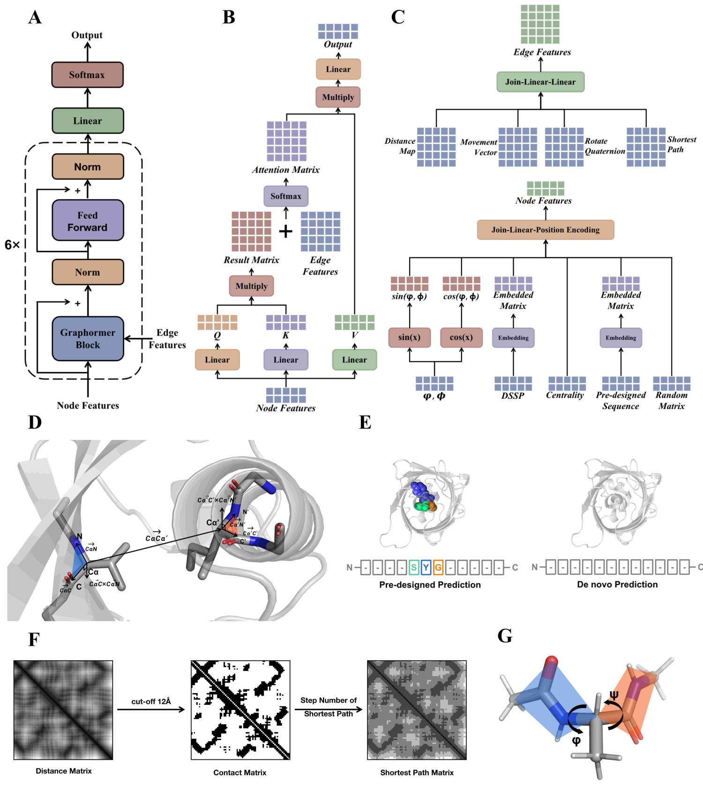

# GPD
Graphormer-based Protein Design (GPD) model deploys the Transformer on a graph-based representation of 3D protein structures and supplements it with Gaussian noise and a sequence random mask applied to node features, thereby enhancing sequence recovery and diversity. The performance of GPD model was significantly better than that of state-of-the-art model for ProteinMPNN on multiple independent tests, especially for sequence diversity.



# Install
## Quick Start
One can use pip to directly install our package
```
pip install fair-GPD
```
### Note:
For 40 series gpus, we recommend use the following methods to install. For the current pip installed pytorch may have some errors with 40 series gpus.
## Install with conda
```
conda create -n GPD
source activate GPD
conda install pytorch==1.12.1 -c pytorch
conda install -c conda-forge mdtraj==1.9.9
conda install -c anaconda networkx==3.1
```
Note that GPD could be used with cuda, you can install the cudatoolkit package according to your own gpu version.
Also, one could use our given ```environment.yml``` file to create an environment
```
conda env create -f environment.yml
```
## Install with pip
One can use our given ```requirements.txt``` file for pip installation
```
pip install -r requirements.txt
```

# Example
```
cd test/
sh submit_example_2_fixed.sh  (simple example)
sh submit_example_1.sh (fix some residue positions)
```

## Output example:
outputs/example_1_outputs/1tca.fasta
```
> predicted model_0	acc: 0.3501577287066246	length: 317
APTGAAPPLTLPPATLRAQLAAKGASPEDLKNPVLILHGPGTDGAEDFAGFLVRLLKSKGYTPAYVDPDPN
ALDDIADDLEALALAAKYLAAGLGNKPFNVITHSLGGVALLTALAYHPELRDKIKRVVLVSPLPTGSDSLR
ALLAANTLRLLQFLSVKGSALDDAARKAGALTPLVPTTVIGHANDPLHYPTSLGSPASGAYVPDARVIDLY
SVYGPDFTVDHAEAVFSSLVRKALKAALTSSSGYARASDVGKSLRVSDPAKDLSAEQREAFLNLLAPAAAA
IANGKTGNACPPLPPEYLPAAPGAKGAGGVLTP
> predicted model_1	acc: 0.334384858044164	length: 317
APTGEPLPLLLPDATLLANVEADGADIDEVTNPVLLLHGLGSDGEEALGASLVALLKALGYTPLGVDPDPN
YTDDILDDAQALAAAARALAAGLGNKPLLVVGHSLGGVVVLLALRYNPALADLIASVILVAPAPRGSSEAR
PLIAAKILRPEDFLLLYGSALADALRAAGLDVPLVPTTVIDSADDPLHSPNALLSAESAAYVPGGTVVDLS
DIFGPDFTVSHAGAVLSPFLRKLLEAALASPTGVPREEDVGASLLDLDLAADLTAEERAAALNALAAYAAR
IAAGARFNAYPALPPELVPAAKGATDAAGTLKP
```
*  **acc** is recovery. Recovery was the proportion of the same amino acids at equivalent position between the native sequence and the designed sequence
*  **length** is the length of designed sequence.

# Training the GPD model
## Dataset
The GPD model was trained using the CATH 40% sequential non-redundancy dataset, with a split ratio of 29868:1000:103 for the training, validation, and testing sets, respectively. We further evaluated the performance of GPD using 39 de novo proteins, including 14 de novo proteins that exhibit significant structural differences from proteins belonging to natural folds.
*  **data/cath-dataset-nonredundant-S40-v4_3_0.pdb** is CATH 40% sequential non-redundancy dataset downloaded from http://download.cathdb.info/cath/releases/all-releases/v4_3_0/non-redundant-data-sets/cath-dataset-nonredundant-S40-v4_3_0.pdb.tgz
*  **data/sc103** is 103 single chain proteins
*  **data/denovo39** is 39 de novo proteins
*  **data/denovo14** is 14 de novo proteins

## Training the GPD model
**train/train_encoder3.py** Its training lasted 1 days and utilized 1 NVIDIA 40G A100 GPUs
